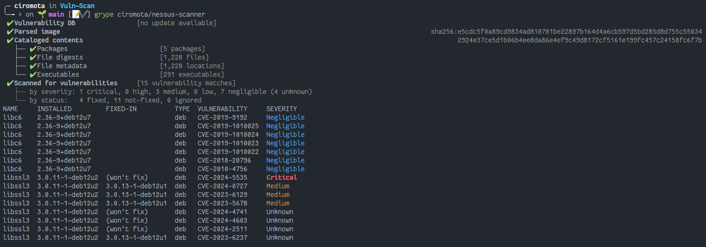
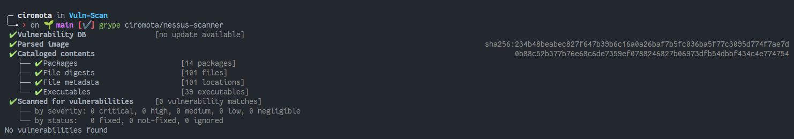

<h2>Unofficial Nessus Essential Scanner</h2>

<p align="center">
    
    
    
    
</p>

Tenable's Nessus Scanner is a vulnerability scanner that looks for known vulnerabilities, configuration issues and more by inspecting hosts over the network. For more information about Nessus, see the following link:

▶️ [Nessus Docs](https://docs.tenable.com/nessus/Content/GettingStarted.htm)

> [!WARNING]\
> The content of **this repo** is licensed under GPL-3.0 license. You will need to check the [Nessus](https://static.tenable.com/prod_docs/Tenable-Master-Agreement-Template-v6-(2.2023)-CLICK.pdf) scanner license if you want any other commercial use.

## 💪 Distroless

In this project, only what is essential for running the application is used. Now we using the image from `cgr.dev/chainguard/wolfi-base` with zero CVE's and a working image of minimum size will be provisioned. See below the before and after.

<details>
  <summary>Click to expand</summary>



</details>

## 📋 Requirements for build and use

- Docker, Podman, DockerSlim or Containerd/nerdctl.
- License to use Nessus. You can get it [here](https://www.tenable.com/products/nessus/activation-code).

You can safely inspect and use [my already compiled image](https://hub.docker.com/r/ciromota/nessus-scanner) or build your own based on the instructions below.

## 🐳 Docker
### Build:

- Clone this repository.
- Run the command: `docker buildx build -t ciromota/nessus-scanner:latest .`
- Or uncomment line 5 in `docker-compose.yml` for build and run.

### Usage:

```bash
docker container run -td --name nessus-scanner -p 8834:8834 -v \
/etc/localtime:/etc/localtime ciromota/nessus-scanner:latest
```
Or through docker-compose: `docker-compose up -d`.

- Access `https://localhost:8834`

## 🦭 Podman

[Podman](https://podman.io/) is a container engine for developing, managing and executing containers as an alternative to Docker.

### Build:

- Clone this repository.
- Run the command: `podman build -t ciromota/nessus-scanner:latest -f .`
- Or uncomment line 5 in `docker-compose.yml` for build and run.

### Usage:

Practically the same as Docker.

```bash
podman run -td --name nessus -p 8834:8834 -v \
/etc/localtime:/etc/localtime ciromota/nessus-scanner:latest
```
Or through docker-compose: `docker-compose up -d`.

- Access `https://localhost:8834`

## ➖ DockerSlim

[DockerSlim](https://github.com/docker-slim/docker-slim) brings a new experience in container management keeping its same workflow, producing a smaller and secure container.

Consult the documentation and learn about all its functions.

### Build and usage:

You can run DockerSlim on top of the previously built image and reduce the size of the Nessus Scanner image without harm, just use the command below:

```bash
docker-slim build ciromota/nessus-scanner
```

Or, it is possible with the help of DockerSlim itself to build a new image based on the Dockerfile file contained in this repo. Use the command below:

```bash
docker-slim build --dockerfile Dockerfile --show-blogs --tag ciromota/nessus-scanner.slim .
```

In both cases, you can run the container in the same way:

```bash
docker container run -td --name nessus -p 8834:8834 -v \
/etc/localtime:/etc/localtime ciromota/nessus-scanner.slim
```
- Access `https://localhost:8834`

## 🤓 nerdctl

nerdctl is a Docker-compatible CLI for contai**nerd**. Its syntax is basically the same used for Docker and Podman for example. Besides being rootless, it has other interesting functions, I recommend getting to [know it](https://github.com/containerd/nerdctl).

### Build:

- Clone this repository.
- Run the command (BuildKit will need to be installed first. See documentation.):

```bash
nerdctl image build -t ciromota/nessus-scanner:latest .
```

- Or uncomment line 5 in `docker-compose.yml` for build and run:

```bash
nerdctl compose -f docker-compose.yml up -d
```

### Usage:

```bash
nerdctl run -d --name nessus-scanner -p 8834:8834 -v \
/etc/localtime:/etc/localtime ciromota/nessus-scanner:latest
```
Or through docker-compose: `nerdctl compose up -d`

- Access `https://localhost:8834`

## ✔️ Official Container

Tenable Nessus since from version 8.x.x has its official container image if you wish to use an image from the developer himself.

▶️ https://hub.docker.com/r/tenableofficial/nessus
